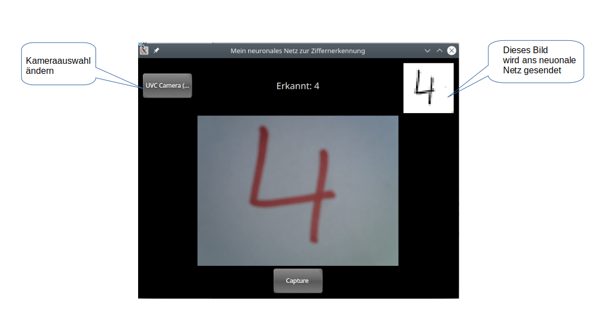
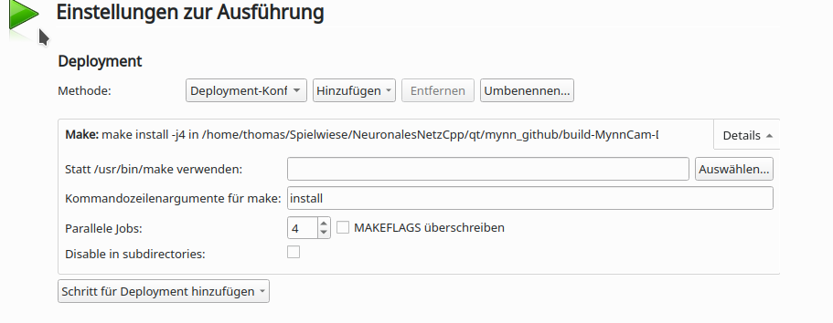

# Einfaches neuronales Netz zur Erkennung von Ziffern

Implementierung eines einfachen neuronalen Netzes zur Erkennung von Ziffern.
Der Algorithmus basiert auf dem, im Buch von Tariq Rashid [^1] vorgestellten Algorithmus.  Der Autor hat auch den Python-Code zu seinem Buch in Github abgelegt [^2].

Unter [mynnKlasse](https://github.com/thw73/mynn/tree/main/mynnKlasse) ist eine Cpp Implementierung von diesem Algorithmus zu finden.

Um dieses neuronale Netz praktisch zu testen und nutzen zu können, wird das unter [[mynncam](https://github.com/thw73/mynn/tree/main/mynnCam)] erstellte und trainierte neuronale Netz genutzt, um per Webcam einzelne Ziffern zu erkennen.
Dieses Programm läuft unter Windows und Linux, sowie als App auf einem Android Device.

<b>Linux / Windows</b>

<p align="center">

</p>

<b>Android</b>
<p align="center">

</p>

Als Framework für beide Programme wird QT in der Version 5.15.2 genutzt. [^3]. 
Da sich die Schnittstelle zwischen QML und den Multimedia Klassen in QT6 stark geändert hat, kann QT in der Version 6.x nicht für mynnwebcam genutzt werden.

## MYNN Klasse

#### Hinweise für die Compilierung der Software
Neben dem QT Framework, wird für Vector-Operationen, wie Transpose, die EigenLib [^4] [^5] genutzt. Hier muss der Include-Pfad in der Datei mynn_eigenKlasse.pro angepasst werden: <br>
``` 
z.B. INCLUDEPATH += C:\work\EigenLib\eigen-3.4.0
```

Die Software sollte als Release gebaut werden, da ansonsten die Berechnung des neuronalen Netzes deutlich länger dauert.

#### Nutzung der Software
Die MNIST Trainings- und Testfiles können im cvs Format von [^6] heruntergeladen werden.<br>
<br>
mynn.exe bzw. mynn hat folgende Eingangsparameter:<br>
``` 
 -t Trainingsdatensatz
 --cs berechnet die Scorecard mit dem übergebenen Testdatensatz
 --wih gelernte Input – Hiddenlayer Werte
 --who gelernte Hidden – Output Werte
 --swih speichert die gelernten „Input – Hiddenlayer „Werte ab
 --swho speichert die gelernten „Hidden – Outputlayer“ Werte ab
``` 

##### Beispiel:
Trainieren und testen vom neuronalen Netz:<br>
``` 
mynn -t mnist_train.csv –cs mnist_test.csv
``` 
Trainieren und testen vom neuronalen Netz inkl. abspeichnern der gelernten Werte:<br>
``` 
mynn -t mnist_train.csv –cs mnist_test.csv --swih wih.cvs --swho who.cvs
```

# MYNN-Webcam
In diesem Beispiel wird die in [mynnKlasse](https://github.com/thw73/mynn/tree/main/mynnKlasse) erstellte Klasse, etwas angepasst, genutzt um Ziffern per Webcam bzw. der Smartphone-Kamera zu erkennen.

## MYNN-APP
Als Basis für die Software, dient das Beispiel von Stephen Quan [^10] zur Nutzung der QAbstractVideoFilter Klasse von QT.
Auch hier wird die EigenLib [^4] genutzt.
Zur Bildaufbereitung wird die OpenCV Libary [^7] verwendet. Getestet wurde die Software unter Windows mit der OpenCV Version 4.5.2 und Android mit der Version 4.5.4, siehe [^8] bzw. [^9]. Unter Linux wurde, die mit der Linux-Distribution ausgelieferte, OpenCV Version genutzt. 

### Architektur


<p align="center">

</p>
<br>
<b> Main: </b> Hier werden die Klassen instanziert und die Verbindung zur QML GUI hergestellt.<br>
<b> MynnWrapper: </b> Initialisiert das neuronale Netz und berechnet aus dem Bild die erkannte Ziffer.<br>
<b> Mynn: </b> Neuronale Netz zur Berechnung der erkannten Ziffer.<br>
<b> MyImageProvider: </b> Sendet das in MyFilter berarbeitete Bild an die QML GUI.<br>
<b> MyFilter: </b>  Wandelt das Kamerabild in ein Schwarzweiss-Bild um. Reduziert die Bildgroeße auf die fuer das neuronale Netz benoetigte Groesse von 28x28 Pixeln.<br>
<b> MyFilterRunnable: </b> Stellt die Schnittstelle zwischen Kamera und QML GUI dar.<br>


### Hinweise für die Compilierung der Software

#### Anpassung der *.pro Datei

Je nach dem für welches Betriebssytem, die Software erstellt werden soll, müssen die Variablen, angepasst werden.

Anpassung Include-Pfad für die EigenLib:<br>
``` 
z.B. INCLUDEPATH += C:\work\EigenLib\eigen-3.4.0
```
Anpassung der OPENCV_ANDROID_SDK_PATH Variable
```
z.B. OPENCV_ANDROID_SDK_PATH = /home/thomas/Spielwiese/OpenCV-android-sdk_4_5_4/
```

**Hinweis für Windows:**<br>
Damit die OpenCV Libaries beim Ausführen der Software gefunden werden, muss die Windows Umgebungsvariable PATH muss auf die OpenCV Binaries gesetzt werden.<br>
Beispiel:<br>
```
Path=C:\OpenCV-MinGW-Build-OpenCV-4.5.2-x64\x64\mingw\bin
```
 
**Hinweis für Linux:**<br>
Hier wurden die mit der Linux-Distribution ausgelieferte OpenCV Version genutzt.
Ggf. müssen die Variablen INCLUDEPATH und LIBS für OpenCV in mynn_eigenKlasse.pro angepasst werden.


#### Anpassung QT Creator Einstellungen:

Für das Deployment der wih.cvs & who.cvs Dateien, muss im QT Creator unter Einstellung zur Ausführung „install“ bei Make arguments angeben werden. Damit werden diese Dateinen in Build-Verzeichnis kopiert.

<p align="center">

</p>

**Hinweis für Android:**<br>
Als Target-Architektur wird arm64-v8a verwendet.<br>
Deshalb darf im QT Creator unter Projekt Build Einstellungen, nur die arm64-v8a ABI ausgewählt sein.
<p align="center">

</p>
 


### Referenzen

[^1]: Buch: Neuronale Netze selbst programmieren von Tariq Rashid <br>https://dpunkt.de/produkt/neuronale-netze-selbst-programmieren

[^2]: https://github.com/makeyourownneuralnetwork/makeyourownneuralnetwork

[^3]: https://www.qt.io/ 

[^4]: https://eigen.tuxfamily.org

[^5]: https://gitlab.com/libeigen/eigen/-/releases/3.4.0

[^6]: https://pjreddie.com/projects/mnist-in-csv/

[^7]: https://opencv.org/

[^8]: https://opencv.org/releases/

[^9]: https://github.com/huihut/OpenCV-MinGW-Build 

[^10]: https://github.com/stephenquan/MyVideoFilterApp


